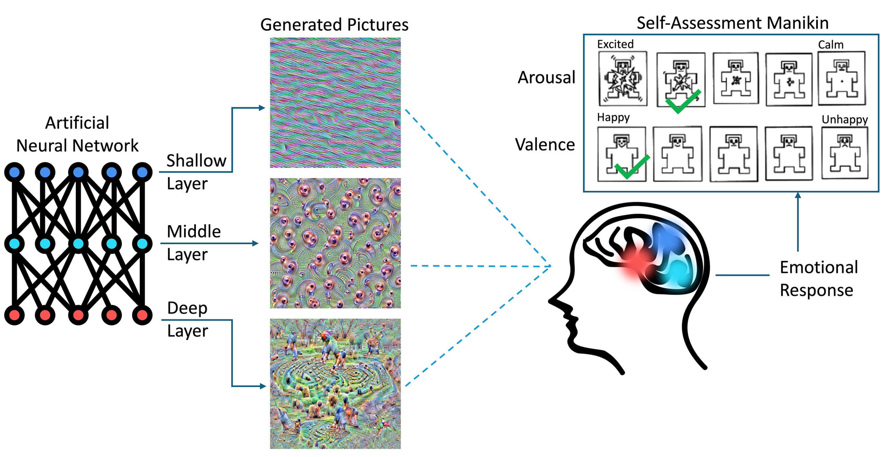

# Assessment of Human Emotional Reactions to Visual Stimuli “Deep-Dreamed” by Artificial Neural Networks

This repository is the official code used to generate the images used in the paper ‘Assessment of Human Emotional Reactions to Visual Stimuli “Deep-Dreamed” by Artificial Neural Networks’ published in [Frontiers in Psychology](https://www.frontiersin.org/journals/psychology/articles/10.3389/fpsyg.2024.1509392/full).

## Summary

**Introduction:** While the fact that visual stimuli synthesized by Artificial Neural Networks (ANN) may evoke emotional reactions is documented, the precise mechanisms that connect the strength and type of such reactions with the ways of how ANNs are used to synthesize visual stimuli are yet to be discovered. Understanding these mechanisms allows for designing methods that synthesize images attenuating or enhancing selected emotional states, which may provide unobtrusive and widely-applicable treatment of mental dysfunctions and disorders.

**Methods:** The Convolutional Neural Network (CNN), a type of ANN used in computer vision tasks which models the ways humans solve visual tasks, was applied to synthesize (“dream” or “hallucinate”) images with no semantic content to maximize activations of neurons in precisely-selected layers in the CNN. The evoked emotions of 150 human subjects observing these images were self-reported on a two-dimensional scale (arousal and valence) utilizing self-assessment manikin (SAM) figures. Correlations between arousal and valence values and image visual properties (e.g., color, brightness, clutter feature congestion, and clutter sub-band entropy) as well as the position of the CNN's layers stimulated to obtain a given image were calculated.

**Results:** Synthesized images that maximized activations of some of the CNN layers led to significantly higher or lower arousal and valence levels compared to average subject's reactions. Multiple linear regression analysis found that a small set of selected image global visual features (hue, feature congestion, and sub-band entropy) are significant predictors of the measured arousal, however no statistically significant dependencies were found between image global visual features and the measured valence.

**Conclusions:** This study demonstrates that the specific method of synthesizing images by maximizing small and precisely-selected parts of the CNN used in this work may lead to synthesis of visual stimuli that enhance or attenuate emotional reactions. This method paves the way for developing tools that stimulate, in a non-invasive way, to support wellbeing (manage stress, enhance mood) and to assist patients with certain mental conditions by complementing traditional methods of therapeutic interventions.

<p align="center">
  
</p>

*Figure above: Overview of the experiment carried out in this study. The visual stimuli were synthesized in a way to activate selected sections (e.g., layers) of an Artificial Neural Network (ANN). Such stimuli, when presented to a subject, evoked reactions that were self-reported by selecting the levels of arousal and valence experienced during the experiment. The colors matching various sections of the ANN and the brain illustrate the hypothesis that visual signals synthesized that way may stimulate different functional brain areas, resulting in different emotional reactions.*

## How to run

Modify (if needed) and run `Image_Generation.py` to generate dream-ified pictures starting from the noise samples included into this repository.

## Citation

```
@article{10.3389/fpsyg.2024.1509392,
  AUTHOR={Marczak-Czajka, Agnieszka and Redgrave, Timothy and Mitcheff, Mahsa and Villano, Michael and Czajka, Adam},
  TITLE={Assessment of human emotional reactions to visual stimuli “deep-dreamed” by artificial neural networks},
  JOURNAL={Frontiers in Psychology},
  VOLUME={15},
  YEAR={2024},
  URL={https://www.frontiersin.org/journals/psychology/articles/10.3389/fpsyg.2024.1509392},
  DOI={10.3389/fpsyg.2024.1509392},  
  ISSN={1664-1078}
}
```
